# Batch Toolkit Studio


A high-performance Windows desktop application built with **WPF** and **C#** designed to automate image conversion, extract frames, and streamline file management workflows. The tool operates completely standalone using `Magick.NET`, requiring no external dependencies like ImageMagick or Python to be installed on the host system.

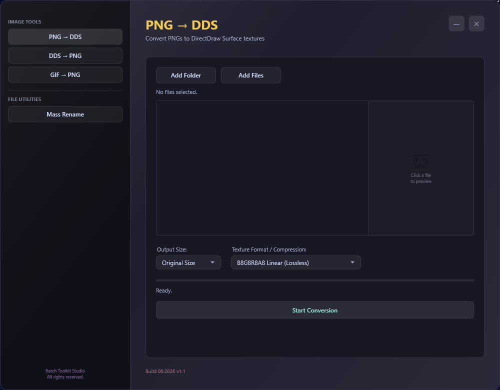
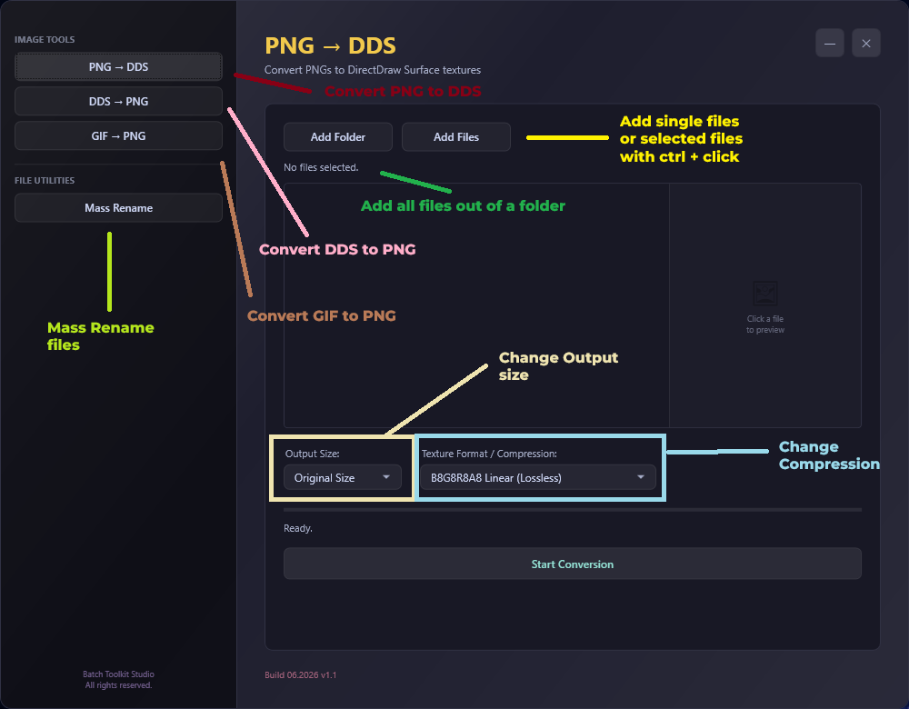

---

## ✨ Features & Showcase

### 1. Smart Previews & Metadata
The interface dynamically adapts to your selected files. Animated GIFs are rendered as live, animated previews directly in the app, while other formats display detailed, comprehensive file metadata.

| GIF Preview | DDS Metadata | PNG Metadata |
|:---:|:---:|:---:|
| 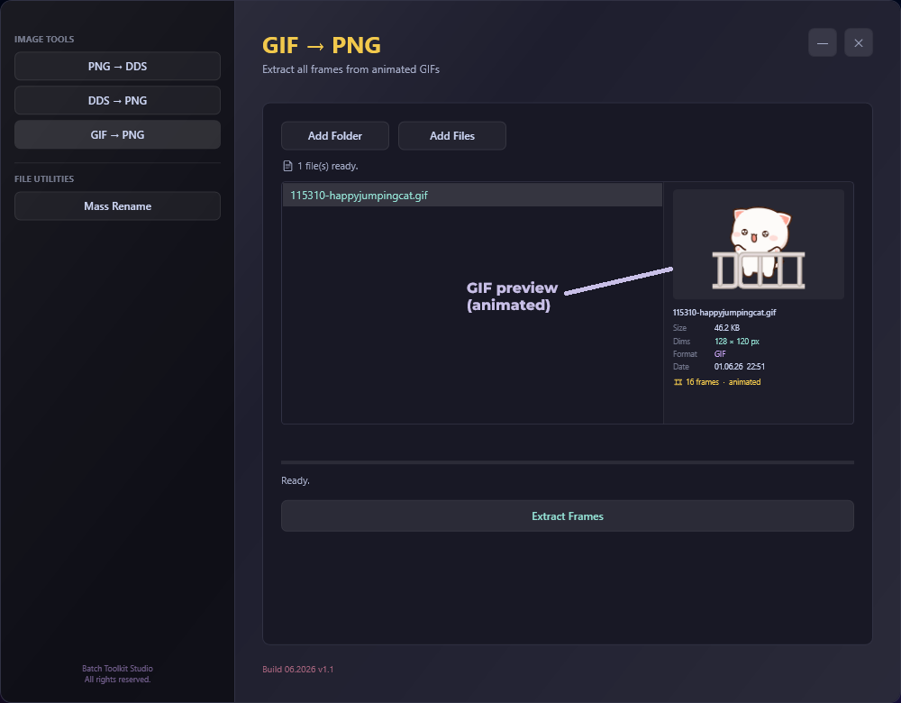 | 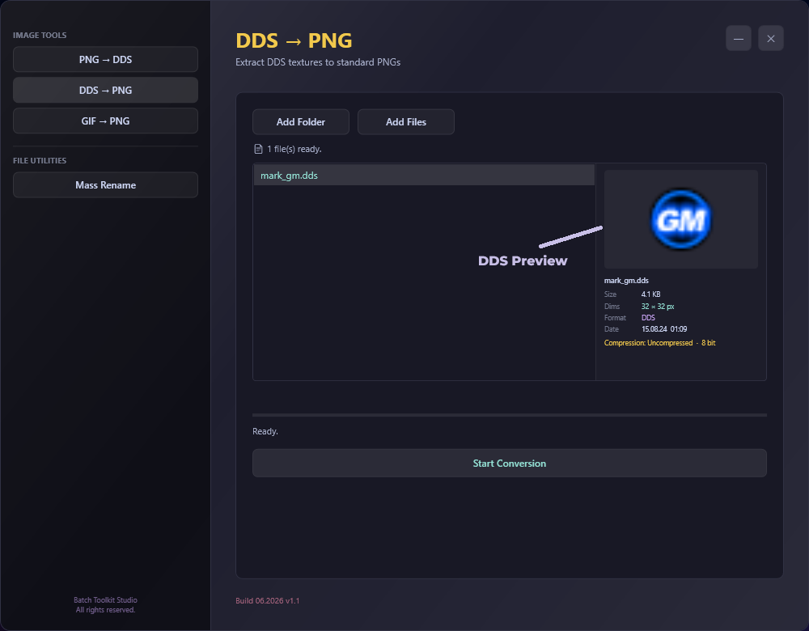 | 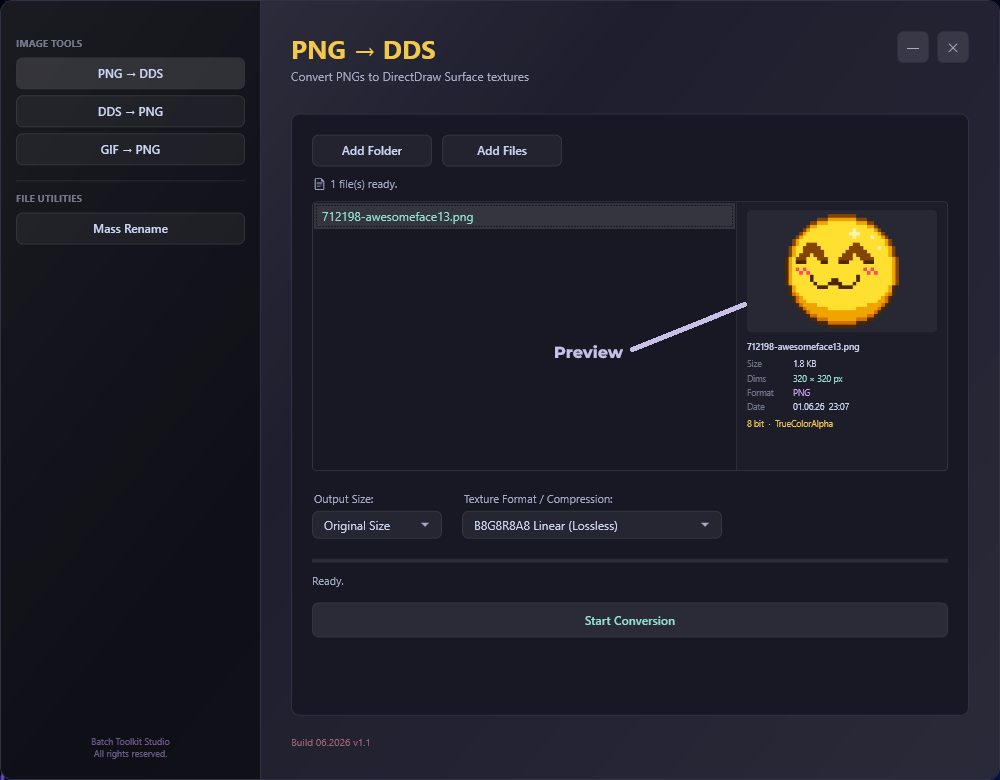 |

### 2. Lossless Image Conversion (PNG ↔ DDS)
Flawlessly convert PNG files to DirectDraw Surface (`.dds`) textures. Includes full support for `B8G8R8A8 Linear` (lossless), `BC3 (DXT5)`, and `BC1 (DXT1)` compression formats, as well as forced texture resizing (e.g., 24x24, 64x64). Conversely, extract DDS textures back to standard PNGs with zero quality degradation.

| High-Quality DDS Output | Lossless PNG Recovery |
|:---:|:---:|
| 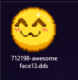 | 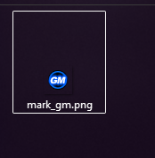 |

### 3. GIF Frame Extraction
Instantly unpack animated GIFs into individual, high-quality PNG frames. The toolkit automatically creates dedicated sub-directories and extracts the full sequence flawlessly.

| Single GIF Frame | Full Extracted Sequence |
|:---:|:---:|
| 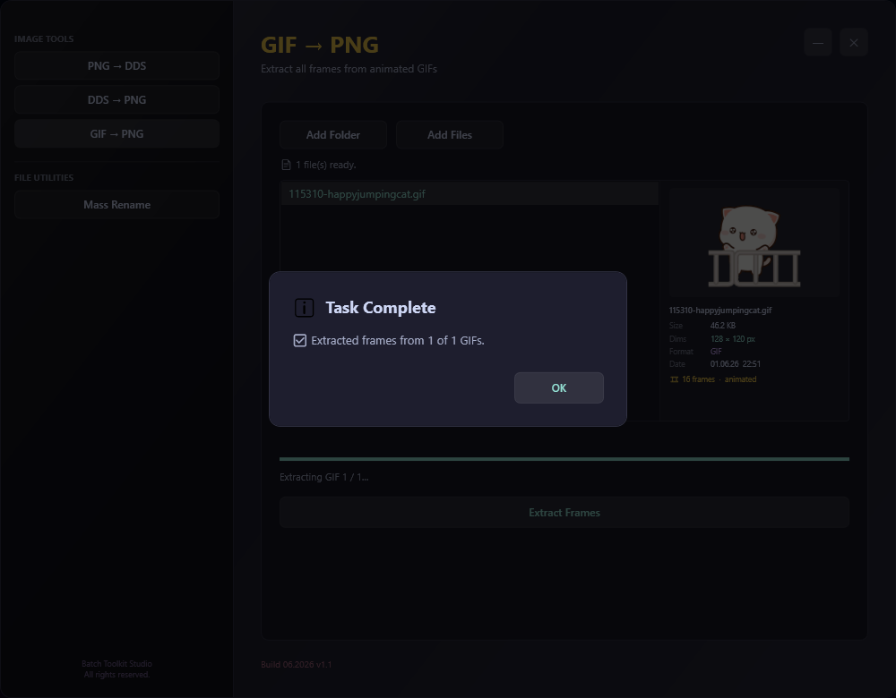 | 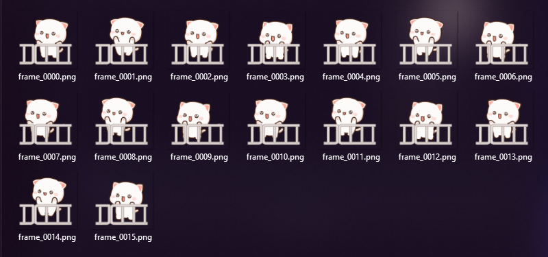 |

### 4. Mass File Renaming
Keep massive asset libraries organized using an intelligent batch renaming utility that applies customizable, auto-incrementing naming patterns across your files in seconds.

| Renaming Setup | Execution Result |
|:---:|:---:|
| 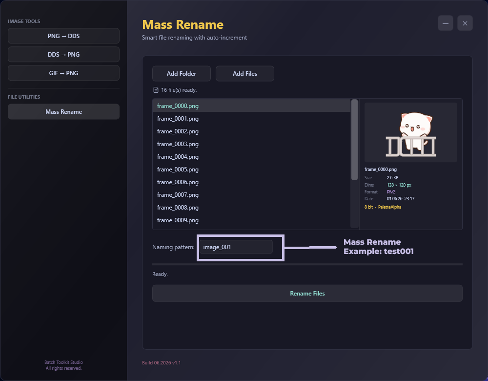 | 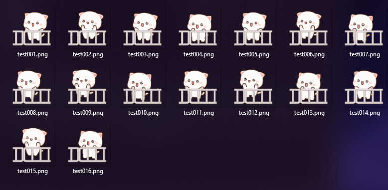 |

---

## 🛠️ Technical Details & Setup

* **Framework:** .NET Framework 4.8 / Windows Presentation Foundation (WPF)
* **Imaging Engine:** Powered by [Magick.NET](https://github.com/dlemstra/Magick.NET).
* **UI Theme:** Custom "Midnight Elegance" glassmorphism interface.
* **Standalone Deployment:** Uses [Costura.Fody](https://github.com/Fody/Costura) to embed all `.dll` libraries into a single, portable executable.

### ⚠️ Note for Developers
The `MainWindow.xaml` source file is **not included** in this repository. To compile the project successfully, you must ensure that your local project directory contains the necessary XAML design file and its associated C# code-behind.

### Build Instructions
1. Clone the repository and open the solution in Visual Studio.
2. Restore the following NuGet Packages:
   * `Magick.NET-Q16-x64`
   * `Costura.Fody`
   * `WindowsAPICodePack-Shell` (for modern Windows Folder Dialogs)
3. Ensure the project is set to **Release** and **x64** (ImageMagick requires 64-bit architecture).
4. Verify that the `FodyWeavers.xml` file is present in the root directory:
```xml
   <?xml version="1.0" encoding="utf-8"?>
   <Weavers xmlns:xsi="[http://www.w3.org/2001/XMLSchema-instance](http://www.w3.org/2001/XMLSchema-instance)" xsi:noNamespaceSchemaLocation="FodyWeavers.xsd">
     <Costura CreateTemporaryAssemblies="true" IncludeDebugSymbols="false"/>
   </Weavers>
